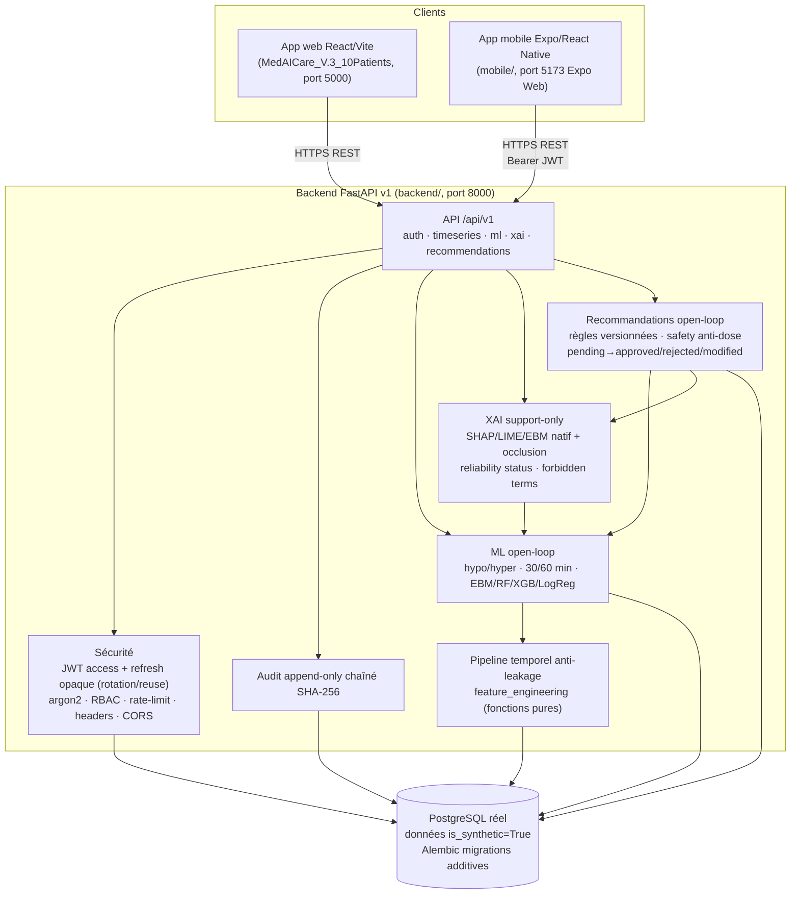

# Architecture finale — MediAI Care

> **Phase 7 — document d'architecture consolidé.** Prototype académique non certifié ·
> données synthétiques · open-loop strict · XAI support-only · API = source de vérité.

## 1. Vue d'ensemble
Trois couches applicatives autour d'une API FastAPI v1 qui est la **source de vérité**
unique (aucun calcul métier côté client/mobile) :



## 2. Backend FastAPI
- **Stack** : FastAPI · SQLAlchemy 2 (types portables) · Alembic · Pydantic v2.
- **Endpoints v1** : `auth/{login,refresh,logout,me}` · `timeseries/{cgm,insulin,meals,
  activity,events}` · `ml/predict` · `xai/{explain,global}` · `recommendations/{generate,
  (list),mine,{id},{id}/approve,{id}/reject,{id}/modify}`.
- **OpenAPI** enrichi : `securityScheme` BearerAuth + marqueur `x-open-loop` + exemples.

## 3. PostgreSQL
- Base **réelle** ; toutes les données métier portent `is_synthetic=True`.
- Migrations **additives rejouables** (aucune migration destructive).
- Tables clés : users, patients, refresh/token families, audit_log (chaîné), timeseries
  (cgm/insulin/meals/activity/events), predictions, model_registry, xai_explanations,
  recommendations.

## 4. Pipeline temporel (anti-leakage)
- `feature_engineering.py` = **fonctions pures** (rolling/slope/TIR/post-prandial/
  calendaires) refusant tout point futur.
- Timestamps tz-aware normalisés UTC ; bornes physiologiques ; ingestion idempotente
  (201 créé / 200 doublon, concurrency-safe).

## 5. ML (open-loop)
- Cibles `hypo`(<70)/`hyper`(>180) ; horizons 30/60 min ; fenêtre future `(T, T+h]`.
- Split **temporel** 0.6/0.2/0.2 aligné sur les frontières de timestamps (0 chevauchement).
- 4 couples actifs (EBM/RF/XGBoost) ; registre = un seul actif par (cible, horizon).
- Probabilités uniquement, **aucune décision/dose**. Métriques réelles ou « non calculable ».

## 6. XAI (support-only)
- Méthodes par modèle : EBM natif · SHAP (XGB/RF/LogReg) · LIME · **occlusion fallback**
  documenté.
- `xai_reliability_status` ∈ {reliable_for_model_debug, caution_semantic_limits,
  not_reliable_for_clinical_interpretation} ; warnings jamais masqués.
- Termes interdits testés ; XAI ≠ causalité ; dissociation calibration explicite.

## 7. Recommandations (open-loop)
- Catégories non prescriptives ; règles versionnées (seuils synthétiques NON cliniques).
- Safety : termes interdits + regex anti-dose → `safety_blocked` (400).
- Workflow `pending → approved|rejected`, `pending → modified → approved|rejected`.
- `clinical_justification_allowed` **jamais** `true` ; probabilités verrouillées serveur.

## 8. Sécurité
- JWT access court + **refresh opaque** (hashé en base, rotation + détection de
  réutilisation → révocation de famille).
- argon2id ; RBAC serveur (rôle + ownership) ; rate-limiting (login/refresh + endpoints
  coûteux) ; en-têtes (`nosniff`, `DENY`, `no-referrer`) ; CORS par env ; `/ready`→503.
- Mobile : jetons SecureStore (mémoire volatile sur web), jamais loggés, logout/refresh
  échoué effacent.

## 9. Audit
- `AuditLog` append-only : `sequence` + `prev_hash` + `entry_hash` (SHA-256 d'un JSON
  canonique). `verify_chain` recalcule la chaîne ; contraintes d'unicité anti-fork.
- Couverture : auth, ingestion, `ml.predict`, `xai.explain`/`global`, workflow recos
  (generated/safety_blocked/approve/reject/modify).

## 10. Mobile
- Expo Router (file-based) · TanStack Query (cache mémoire) · client `fetch` typé
  (timeout 15 s, retry GET, refresh auto 401, mapping erreurs FR) · contexte auth.
- RBAC : patient = ses données + recos approuvées ; clinicien/admin = workflows complets.

## 11. Limites Replit
- Mobile = Expo Web uniquement (pas de device/QR, EAS, caméra, push, Keychain réel,
  capture auto).
- Tests backend exécutés **par lots** (anti-OOM).
- Rate-limit **par IP** (idéal par-utilisateur derrière proxy — documenté).
- Enveloppe d'erreur uniforme proposée, non implémentée (préserve `{"detail"}` + tests).

## 12. Flux séquentiel d'une recommandation (clinicien)
```
ml/predict (proba) ──► xai/explain (attribution + reliability)
        │                         │
        └──────────► recommendations/generate
                         │  règles versionnées + safety (anti-dose, termes interdits)
                         ▼
                     statut = pending  ──► modify (safety revalidée) ──► approve | reject
                                                                    │
                              patient: GET /recommendations/mine ◄───┘ (approved uniquement)
```

Références : `docs/api/API_V1_CONTRACTS.md`, `docs/security/RBAC_MATRIX.md`,
`docs/security/AUDIT_COVERAGE.md`, `docs/migration/PHASE_*`, `docs/mobile/PHASE_6_MOBILE_APP.md`.
