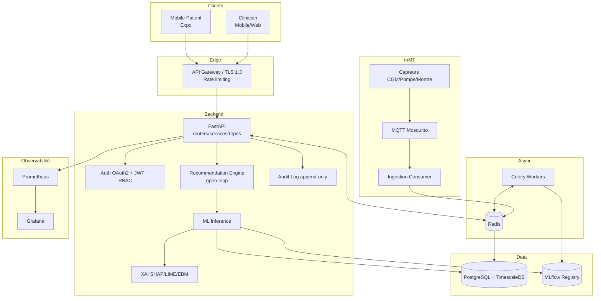
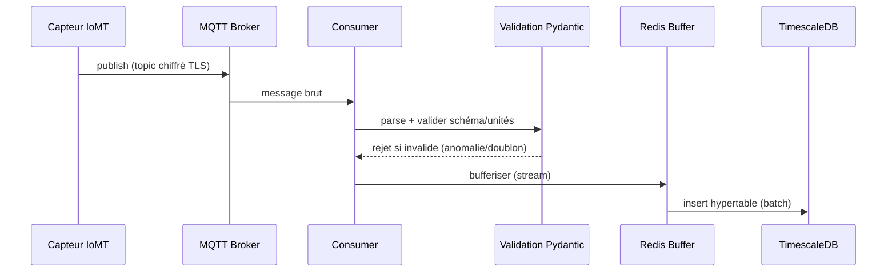
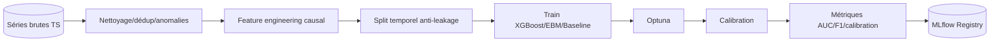
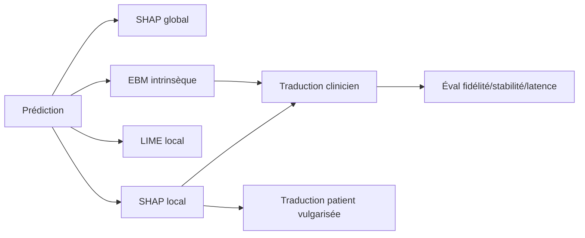
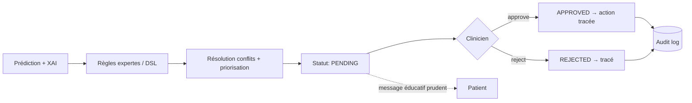
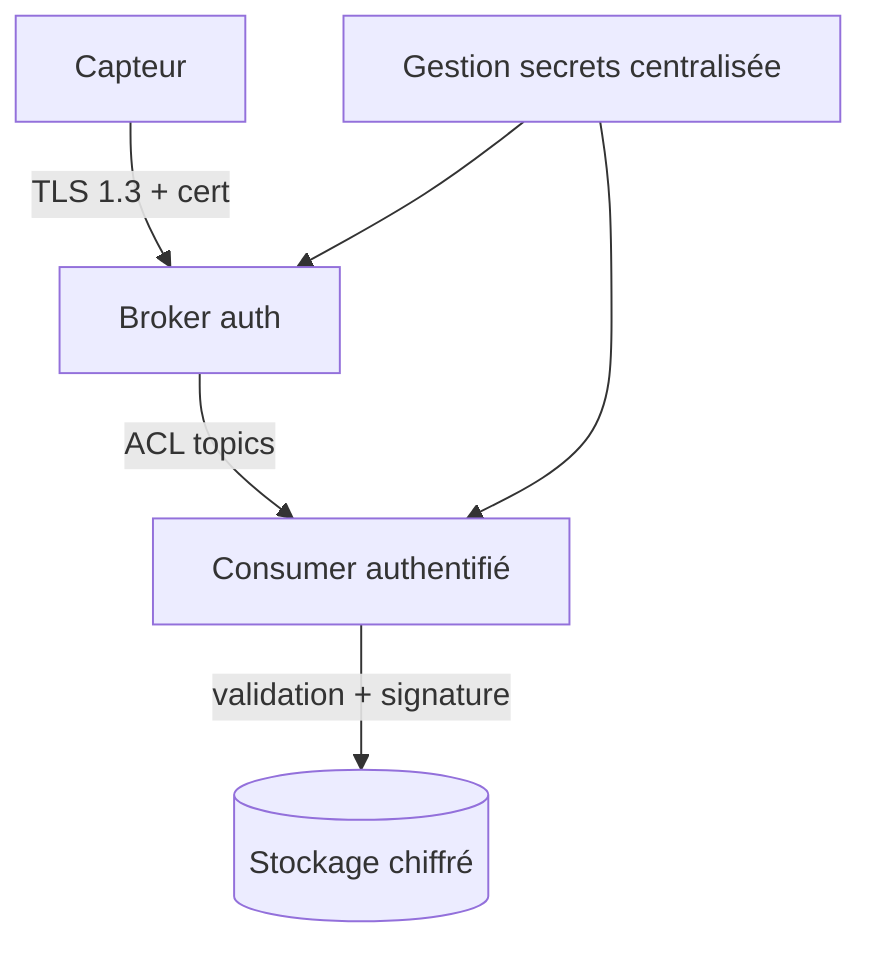
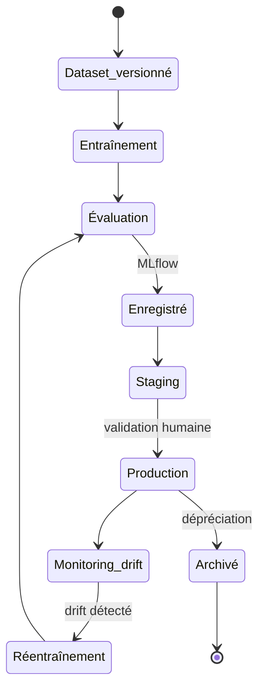
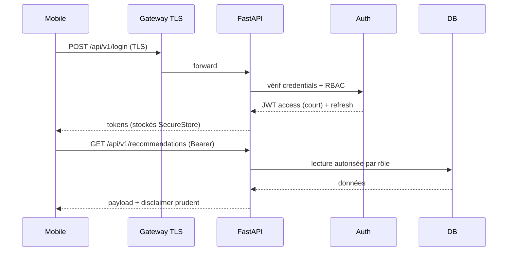
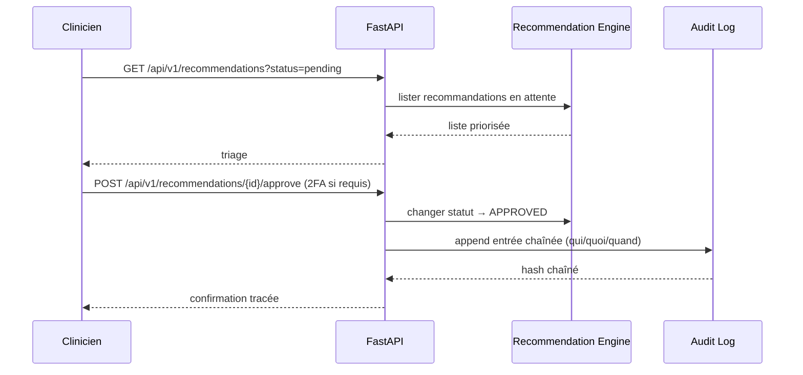

# PHASE 0 — INITIALISATION ET VERROUILLAGE
## Migration MediAI Care : Prototype web → Plateforme mobile IoMT / IA explicable

> **Statut du document** : Livrable de verrouillage — à valider avant Phase 1.
> **Posture** : Open-loop strict · Aide à la décision · Prototype académique non certifié.
> **Date** : 31 mai 2026.

---

## ⚠️ Préalable honnête — Contraintes de l'environnement Replit

Avant de verrouiller, trois réalités d'environnement doivent être assumées (cohérent avec la posture honnête du projet) :

| Élément du cahier des charges | Réalité Replit | Décision |
|---|---|---|
| Docker / Docker Compose (orchestration locale) | Replit ne fournit pas Docker pour l'exécution utilisateur | Les `Dockerfile`/`docker-compose.yml` sont produits comme **livrables de reproductibilité** (exécutables hors Replit) ; sur Replit, chaque service tourne comme **workflow** natif. |
| PostgreSQL + **TimescaleDB** | Replit fournit Postgres managé ; l'extension TimescaleDB n'est pas garantie | Schéma conçu **TimescaleDB-ready** ; fallback Postgres natif (partitionnement par plage temporelle) si l'extension est absente. À vérifier en début de Phase 1. |
| MQTT Mosquitto (broker temps réel) | Pas de broker managé ; un broker peut tourner en workflow mais sans persistance forte | Phase IoMT : broker en workflow pour la démo + **simulateur d'ingestion** ; production hors Replit. |
| React Native **Expo** (mobile) | Supporté (preview via Expo Go / tunnel) | Cible mobile principale, conforme au cahier des charges. |
| Celery + Redis | Redis disponible ; Celery exécutable en worker workflow | Conservé. |
| MLflow / Prometheus / Grafana | Exécutables en process ; pas de SaaS managé | Livrables de configuration fournis ; instanciation en workflow pour démo. |

**Aucun changement de stack n'est imposé** : la stack du cahier des charges est conservée. Ces notes documentent *comment* elle s'instancie sur Replit pour la démo vs. en production hors Replit. Elles alimentent le registre des risques (§0.10) et la stratégie DevOps (Phase 8).

---

## 0.1 — Synthèse des écarts (prototype actuel → cible)

Légende criticité : 🔴 Critique · 🟠 Élevé · 🟡 Moyen · 🟢 Faible.

### Architecture
| Écart | Criticité | Cible |
|---|---|---|
| Application servie en mode dev Vite, code TS/TSX exposé, React Refresh actif | 🔴 | Build production + backend séparé ; aucun source applicatif sensible exposé |
| Aucun backend réel — tout en client | 🔴 | Backend FastAPI autoritaire ; le client ne fait plus autorité |
| Aucune couche de persistance abstraite (`localStorage` direct dans 7 modules) | 🟠 | Repositories serveur (SQLAlchemy) ; client = cache/affichage |
| Pas de séparation logique métier / IO | 🟠 | Architecture en couches (routers → services → repositories) |

### Mobile
| Écart | Criticité | Cible |
|---|---|---|
| Pas d'application mobile native | 🔴 | React Native Expo (patient) + clinicien mobile/web responsive |
| Overflow mobile, logo surdimensionné, contrastes insuffisants | 🟠 | Design system mobile, audit contraste WCAG AA |
| Bouton sans nom accessible | 🟡 | Labels d'accessibilité systématiques |

### Backend
| Écart | Criticité | Cible |
|---|---|---|
| Inexistant | 🔴 | FastAPI + Pydantic + SQLAlchemy + Alembic + Celery + Redis |
| Pas de contrats API versionnés | 🟠 | OpenAPI auto-généré, versioning `/api/v1` |

### Sécurité
| Écart | Criticité | Cible |
|---|---|---|
| Authentification côté client, hash/salt/session en `localStorage` | 🔴 | OAuth2 + JWT court + refresh rotation ; secrets serveur uniquement |
| Pas de RBAC serveur, pas de révocation | 🔴 | RBAC serveur + révocation refresh token |
| Pas de 2FA clinicien | 🟠 | 2FA TOTP obligatoire clinicien |
| Pas de rate limiting réel, headers incomplets | 🟠 | Rate limiting Redis + headers OWASP |

### Données santé
| Écart | Criticité | Cible |
|---|---|---|
| Données médicales côté navigateur | 🔴 | Stockage serveur chiffré au repos ; client = cache éphémère chiffré (SecureStore) |
| Journal d'audit manipulable (non immuable) | 🔴 | Audit log append-only serveur + chaînage cryptographique (hash chaîné) |

### Conformité
| Écart | Criticité | Cible |
|---|---|---|
| Consentement incomplet, pas de DPIA, pas de rétention, pas d'export/suppression | 🔴 | Consentement granulaire, DPIA, politique de rétention, droits RGPD-like / loi 18-07 |
| Pas d'hébergement santé formalisé | 🟠 | Documenté comme exigence de production (hors prototype) |

### IA / ML
| Écart | Criticité | Cible |
|---|---|---|
| « Moteur IA » = règles déterministes ; claims SHAP/LIME/EBM/XGBoost non implémentés | 🔴 | Modèles réels (XGBoost + EBM + baseline règles), entraînés/évalués/versionnés |
| Métriques codées en dur | 🔴 | Métriques calculées (AUC, F1, calibration) tracées MLflow |
| Pas de pipeline temporel anti-leakage | 🔴 | Split temporel strict, features causales uniquement |
| Données simulées non séparées des réelles | 🟠 | Namespace `is_synthetic` explicite, jamais mélangées |

### XAI
| Écart | Criticité | Cible |
|---|---|---|
| Explications = chaînes pré-écrites (maquette d'XAI) | 🔴 | SHAP (global/local) + LIME (local) + EBM intrinsèque, calculés |
| Pas d'évaluation XAI (fidélité/stabilité) | 🟠 | Tests fidélité, stabilité, latence, congruence physiologique |

### IoMT
| Écart | Criticité | Cible |
|---|---|---|
| Intégration entièrement simulée, MQTT/TLS revendiqué mais absent | 🔴 | Ingestion MQTT réelle (broker) + simulateur clairement étiqueté |

### Recommandations
| Écart | Criticité | Cible |
|---|---|---|
| Recommandations proches de prescriptions non supervisées | 🔴 | Moteur **open-loop** strict : pending → validation clinicien → action ; formulations patient prudentes |

### UX / Accessibilité / Performance
| Écart | Criticité | Cible |
|---|---|---|
| Bundle lourd, chargement prématuré de modules | 🟠 | Code splitting, lazy loading |
| Incohérences alertes clinicien | 🟡 | File d'alertes unifiée serveur |
| Accessibilité partielle | 🟡 | Audit WCAG AA, lecteurs d'écran |

### QR / Bilans
| Écart | Criticité | Cible |
|---|---|---|
| QR accepté trop largement, signature non vérifiée cryptographiquement | 🟠 | Vérification signature serveur ; statut « vérifié / non vérifié » fiable ; mapping unités renforcé |

### DevOps / MLOps
| Écart | Criticité | Cible |
|---|---|---|
| Pas de reproductibilité, pas de model registry, pas d'observabilité | 🟠 | Docker, CI/CD, MLflow registry, Prometheus/Grafana, drift monitoring |

---

## 0.2 — Architecture globale consolidée

Composants cibles :

1. **Application mobile patient** (React Native Expo) — dashboard, journal, recommandations *éducatives*, bilans, XAI vulgarisé, offline-first partiel, notifications, biométrie optionnelle, SecureStore.
2. **Espace clinicien** (mobile Expo ou web responsive React 18) — triage, validation des recommandations, fiche patient, audit, exports.
3. **Backend FastAPI** — autorité unique : auth, RBAC, endpoints métier, contrats OpenAPI, rate limiting, audit logs.
4. **Ingestion IoMT MQTT** (Mosquitto) — capteurs CGM/pompe/montre → broker → consumer.
5. **Redis** — buffer streaming IoMT, cache, rate limiting, broker Celery.
6. **PostgreSQL / TimescaleDB** — relationnel (users, prescriptions, audit) + hypertables séries temporelles.
7. **Pipeline feature engineering** — fenêtres glissantes causales, anti-leakage.
8. **ML training** (Celery offline) — XGBoost, EBM, baseline ; Optuna ; MLflow.
9. **ML inference** — service de prédiction hypo/hyper 30–60 min.
10. **XAI** — SHAP + LIME + EBM, traduction patient/clinicien.
11. **Recommendation engine** — open-loop, règles expertes, DSL, workflow validation.
12. **Audit logs** — append-only chaîné.
13. **Notifications** — push (Expo) prudentes/non prescriptives.
14. **Monitoring** — Prometheus + Grafana ; drift modèle.
15. **CI/CD** — GitHub Actions.
16. **Sécurité transverse** — TLS 1.3, JWT, RBAC, chiffrement au repos, secrets centralisés.

---

## 0.3 — Diagrammes (Mermaid textuel)

### 0.3.1 Architecture globale


### 0.3.2 Flux de données IoMT


### 0.3.3 Pipeline ML


### 0.3.4 Pipeline XAI


### 0.3.5 Flux recommandation open-loop


### 0.3.6 Sécurité IoMT


### 0.3.7 Cycle de vie modèle ML


### 0.3.8 Séquence API mobile → backend


### 0.3.9 Séquence validation clinicien


---

## 0.4 — Structure repository (monorepo justifié)

**Choix : monorepo** — cohérence des contrats partagés (types, schémas API), versioning atomique, CI unifiée, plus simple pour un projet académique mono-équipe.

```
mediai-care/
├── backend/                  # FastAPI
│   ├── app/
│   │   ├── api/v1/           # routers versionnés
│   │   ├── core/            # config, sécurité, settings
│   │   ├── services/        # logique métier
│   │   ├── repositories/    # accès données SQLAlchemy
│   │   ├── models/          # ORM
│   │   ├── schemas/         # Pydantic (contrats)
│   │   ├── auth/            # OAuth2/JWT/RBAC/2FA
│   │   └── audit/           # log chaîné
│   ├── alembic/             # migrations
│   └── tests/
├── mobile/                   # React Native Expo (patient)
│   ├── app/                 # Expo Router
│   ├── src/{components,features,services,store,theme}/
│   └── tests/
├── frontend-web/             # clinicien responsive (React 18)
│   └── src/
├── ml/                       # entraînement, inference, XAI
│   ├── pipelines/{features,training,inference,xai}/
│   ├── models/
│   ├── experiments/         # MLflow
│   └── tests/
├── data/                     # schémas, simulateurs, versioning datasets
│   ├── ingestion/           # consumers MQTT
│   ├── simulators/          # Simglucose/AZT1D (étiquetés synthetic)
│   └── schemas/
├── infra/                    # Docker, compose, workflows Replit, monitoring
│   ├── docker/
│   ├── monitoring/{prometheus,grafana}/
│   └── replit-workflows/
├── security/                 # threat model, SECURITY.md, configs OWASP
├── compliance/               # DPIA, consentement, rétention, registre traitement
├── docs/                     # architecture (C4), scientifique, soutenance
├── scripts/                  # outils dev, seed, migration
├── tests/                    # tests e2e transverses
└── .github/workflows/        # CI/CD
```

---

## 0.5 — Standards techniques obligatoires

| Domaine | Standard retenu |
|---|---|
| **Nommage** | `snake_case` Python, `camelCase` TS, `PascalCase` composants/classes, `kebab-case` fichiers config, tables DB `snake_case` pluriel |
| **Branches Git** | `main` (protégée) · `develop` · `feature/*` · `fix/*` · `release/*` · `hotfix/*` |
| **Commits** | Conventional Commits (`feat:`, `fix:`, `docs:`, `test:`, `chore:`, `refactor:`) |
| **API REST** | Ressources au pluriel, verbes HTTP standards, pagination `?page&size`, filtres explicites, statuts HTTP corrects |
| **Format erreurs** | JSON `{ "error": { "code", "message", "details", "trace_id" } }` |
| **Format logs** | JSON structuré : `timestamp, level, service, trace_id, actor_id, event, payload` (PII jamais en clair) |
| **Secrets** | Jamais en code ni client ; variables d'environnement / gestionnaire de secrets ; rotation documentée |
| **Versioning API** | Préfixe `/api/v1` ; breaking change → `/api/v2` |
| **Versioning datasets** | Hash + manifest `dataset_vX.json` (source, date, `is_synthetic`, stats) |
| **Versioning modèles** | MLflow : `model_name@version` + tags (dataset_version, métriques, git_sha) |
| **Migrations DB** | Alembic uniquement ; jamais de modif manuelle ; migration réversible |
| **Feature flags** | Table `feature_flags` + override env ; flags documentés |
| **Environnements** | `dev` / `staging` / `prod` séparés ; configs distinctes ; données réelles jamais en dev |

---

## 0.6 — Matrice de dépendances

| Module | Responsabilités | Dép. entrantes | Dép. sortantes | Données | Risques | Criticité | Tests requis |
|---|---|---|---|---|---|---|---|
| Auth | OAuth2/JWT/RBAC/2FA | Mobile, Web, API | DB, Redis | credentials, sessions | usurpation, fuite token | 🔴 | unit + sécurité |
| API FastAPI | Orchestration métier | Clients | Auth, services, DB | toutes | injection, exposition | 🔴 | unit + intégration |
| Repositories | Accès données | Services | DB | médicales | requêtes non autorisées | 🟠 | unit |
| Ingestion IoMT | MQTT → buffer → DB | Capteurs | Redis, DB | séries CGM | données corrompues | 🔴 | unit + intégration |
| Feature pipeline | Features causales | ML training | DB | séries | leakage temporel | 🔴 | tests anti-leakage |
| ML training | Entraînement modèles | Scheduler | MLflow, DB | datasets | overfit, biais | 🟠 | tests ML |
| ML inference | Prédiction temps réel | API | modèles, DB | features | latence, dérive | 🔴 | unit + perf |
| XAI | Explications | API | inference | attributions | infidélité explication | 🟠 | fidélité/stabilité |
| Recommendation | Open-loop + workflow | API | XAI, règles | recommandations | suggestion dangereuse | 🔴 | unit + scénarios |
| Audit log | Traçabilité chaînée | API | DB | événements | altération | 🔴 | intégrité chaîne |
| Notifications | Push prudentes | Recommendation | Expo push | messages | formulation prescriptive | 🟠 | revue formulation |
| Mobile patient | UI patient | — | API | affichage | overflow, accessibilité | 🟠 | composant + e2e |
| Clinicien | Validation | — | API | recommandations | erreur de validation | 🔴 | e2e |

---

## 0.7 — Roadmap verrouillée (16 semaines)

| Sem. | Objectif principal | Livrables | Dépendances | Critères d'acceptation |
|---|---|---|---|---|
| 1 | Verrouillage + socle infra | Repo monorepo, CI, Postgres/Timescale, compose | Phase 0 validée | CI verte, DB up |
| 2 | Modèle de données + migrations | Schémas ORM, Alembic, hypertables | Sem.1 | Migrations réversibles |
| 3 | Ingestion IoMT + simulateur | Consumer MQTT, simulateur étiqueté | Sem.2 | Données insérées, validées |
| 4 | Feature engineering anti-leakage | Pipeline features, split temporel | Sem.3 | Tests anti-leakage verts |
| 5 | Modélisation baseline + XGBoost | Modèles entraînés, MLflow | Sem.4 | Métriques tracées |
| 6 | EBM + calibration + HPO | EBM, Optuna, calibration | Sem.5 | Calibration documentée |
| 7 | XAI SHAP/LIME/EBM | Explications calculées | Sem.6 | Tests fidélité/stabilité |
| 8 | Recommendation engine open-loop | Règles, DSL, workflow statuts | Sem.7 | Aucun auto-traitement |
| 9 | Backend auth + RBAC + 2FA | Auth complet, rate limiting | Sem.2 | Tests sécurité verts |
| 10 | Endpoints métier + OpenAPI | API v1 complète, audit log | Sem.8,9 | Contrats OpenAPI publiés |
| 11 | Mobile patient (core) | Dashboard, journal, bilans | Sem.10 | Parcours patient fonctionnel |
| 12 | Mobile patient (XAI + offline + push) | XAI vulgarisé, offline, notifs | Sem.11 | Offline partiel OK |
| 13 | Clinicien (triage + validation) | Triage, validation, audit | Sem.10 | Validation tracée |
| 14 | Sécurité & conformité | Threat model, DPIA, SECURITY.md | Sem.9-13 | Checklist OWASP |
| 15 | DevOps/MLOps/observabilité | Prometheus, Grafana, drift, backups | Sem.5-13 | Dashboards live |
| 16 | Validation scientifique + doc | Résultats, ablation, doc soutenance | Tout | Matrice traçabilité complète |

---

## 0.8 — Backlog initial priorisé

### Must
| Prio | Fonctionnalité | Valeur | Complexité | Dépendances | Acceptation |
|---|---|---|---|---|---|
| M1 | Backend auth serveur + RBAC | Sécurité fondamentale | Élevée | — | Tests sécurité verts |
| M2 | Persistance serveur chiffrée | Confidentialité santé | Élevée | M1 | Plus aucune donnée santé client-only |
| M3 | Ingestion IoMT + simulateur étiqueté | Données temporelles | Élevée | M2 | Séries validées en DB |
| M4 | Modèle prédictif réel + métriques | Cœur scientifique | Élevée | M3 | AUC/F1 calculés et tracés |
| M5 | XAI calculé (SHAP/LIME/EBM) | Contribution XAI | Élevée | M4 | Explications fidèles |
| M6 | Recommendation open-loop + validation | Sécurité clinique | Élevée | M5 | Aucun auto-traitement |
| M7 | Mobile patient core | Usage patient | Élevée | M6 | Parcours fonctionnel |
| M8 | Audit log immuable chaîné | Traçabilité | Moyenne | M1 | Chaîne vérifiable |

### Should
| S1 | 2FA clinicien | Sécurité | Moyenne | M1 |
| S2 | Offline-first partiel mobile | Robustesse | Moyenne | M7 |
| S3 | Notifications push prudentes | Engagement | Moyenne | M7 |
| S4 | Monitoring drift modèle | Fiabilité | Moyenne | M4 |
| S5 | Vérification crypto QR bilans | Intégrité | Moyenne | M2 |

### Could
| C1 | Biométrie mobile | Confort | Faible | M7 |
| C2 | Dashboards Grafana avancés | Observabilité | Faible | S4 |
| C3 | Export données patient (RGPD) | Conformité | Moyenne | M2 |

### Later
| L1 | Hébergement santé certifié | Production | Élevée | — |
| L2 | Marquage CE / dossier IEC 62304 | Réglementaire | Très élevée | — |
| L3 | Étude clinique réelle | Scientifique | Très élevée | M5 |

---

## 0.9 — Définition MVP mobile robuste

**Inclus** :
- Authentification serveur sécurisée (JWT + refresh) ;
- Dashboard patient (glycémie, tendance, journal) ;
- Prédiction hypo/hyper 30–60 min issue d'un **modèle réel** ;
- XAI vulgarisé patient + détaillé clinicien ;
- Recommandations **open-loop** avec validation clinicien ;
- Bilans avec statut vérifié/non vérifié ;
- Audit log immuable ;
- Offline-first partiel (lecture cache).

**Exclus du MVP** :
- Boucle fermée / décision automatique (interdit par conception) ;
- Hébergement santé certifié, marquage CE ;
- Capteurs physiques réels (simulateur étiqueté en MVP) ;
- Étude clinique réelle.

**Données simulées vs réelles** : MVP = données **synthétiques** (Simglucose/AZT1D) explicitement marquées `is_synthetic=true`, jamais présentées comme réelles. Aucune donnée patient réelle ingérée tant que conformité non validée.

**Limites médicales** : aucune prescription ; messages patient éducatifs et prudents ; toute suggestion confirmée par un professionnel.

**Critères de réussite** : parcours patient + validation clinicien fonctionnels de bout en bout sur données simulées, modèle évalué et tracé, explications calculées, audit vérifiable.

**Métriques** :
- *Qualité* : couverture tests ≥ 70 % services critiques ; CI verte.
- *Sécurité* : 0 secret en clair ; 0 donnée santé client-only ; checklist OWASP de base.
- *UX/perf* : démarrage mobile < 3 s ; pas d'overflow ; contraste WCAG AA.
- *Modèle* : AUC + calibration documentés sur split temporel.

---

## 0.10 — Registre initial des risques

| Catégorie | Risque | Probabilité | Impact | Mitigation |
|---|---|---|---|---|
| Médical | Interprétation prescriptive d'une suggestion | Moyenne | 🔴 Critique | Open-loop strict, formulations prudentes, validation clinicien |
| Réglementaire | Revendiquer une conformité non atteinte | Moyenne | 🔴 | Posture honnête, mentions « prototype non certifié », DPIA documentée |
| Sécurité | Vol de token / accès non autorisé | Moyenne | 🔴 | JWT court, refresh rotation, RBAC serveur, 2FA clinicien |
| Données | Fuite de données de santé | Faible/Moyenne | 🔴 | Chiffrement au repos/transit, pas de client-only, logs sans PII |
| IA | Modèle biaisé / overfit | Moyenne | 🟠 | Split temporel, calibration, ablation, monitoring drift |
| XAI | Explication infidèle au modèle | Moyenne | 🟠 | Tests fidélité/stabilité, EBM intrinsèque en complément |
| IoMT | Données capteur corrompues/injectées | Moyenne | 🟠 | Validation Pydantic, signature, ACL broker |
| UX | Surcharge cognitive clinicien | Moyenne | 🟡 | Triage priorisé, hiérarchie d'information |
| Performance | Latence inférence/ingestion | Moyenne | 🟡 | Cache Redis, batch, profiling |
| Interprétation patient | Anxiété sur prédiction incertaine | Moyenne | 🟠 | Communication d'incertitude, messages rassurants non alarmistes |
| Environnement | Composant stack indisponible sur Replit (Docker/Timescale/MQTT) | Élevée | 🟠 | Fallbacks documentés (§ préalable), production hors Replit |

---

## 0.11 — Critères de sortie Phase 0

- [ ] Synthèse des écarts validée par le porteur de projet ;
- [ ] Architecture cible approuvée (composants + diagrammes) ;
- [ ] Structure repository acceptée ;
- [ ] Standards techniques adoptés ;
- [ ] Matrice de dépendances revue ;
- [ ] Roadmap 16 semaines acceptée ;
- [ ] Périmètre MVP confirmé (inclus/exclus) ;
- [ ] Registre des risques accepté ;
- [ ] Contraintes environnement Replit comprises et arbitrées ;
- [ ] Posture open-loop et non-certifiée réaffirmée.

---

> **Phase 0 terminée. Validez-vous cette phase pour passer à la Phase 1 — Data Engineering & Pipeline Temporel ?**
